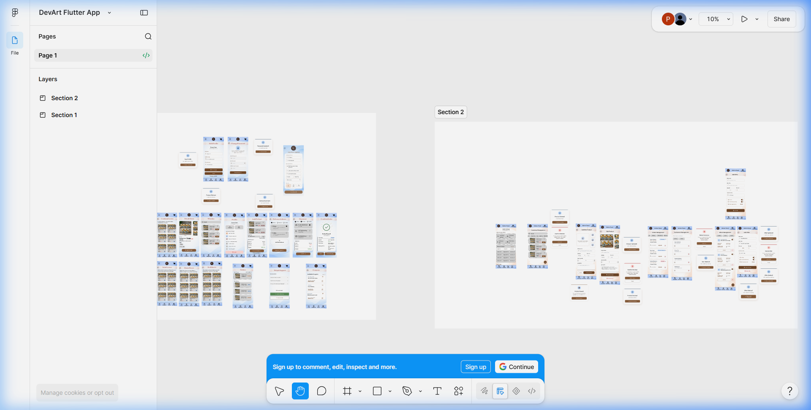
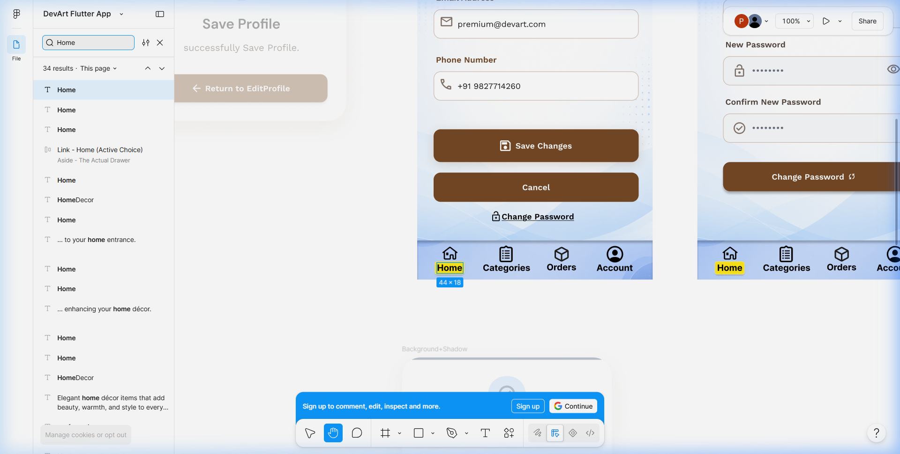

# 🎨 DevArt UI/UX Mobile Design Showcase

Welcome to the design showcase repository for **DevArt**, a premium, high-fidelity mobile application UI/UX concept. This repository contains the interactive Figma prototype and design specifications for both the **Customer Shopping Experience** and the **Store Admin Panel**.

---

## 🔗 Interactive Prototype & Design Links

* **⚡ Live Interactive Prototype**: [Launch Figma Prototype](https://www.figma.com/proto/S5bQWaqh9je6CCEzaqppYL/DevArt-Flutter-App?node-id=2-273&p=f&t=6NYSDUl090e1h4K4-0&scaling=scale-down&content-scaling=fixed&page-id=0%3A1&starting-point-node-id=2%3A273&device-frame=0)
* **🎨 Figma Design File (Dev Mode)**: [Open Figma Design Workspace](https://www.figma.com/design/S5bQWaqh9je6CCEzaqppYL/DevArt-Flutter-App?node-id=0-1&m=dev&t=6NYSDUl090e1h4K4-1)
* **🖥️ Local Prototype Viewer**: Open [index.html](file:///C:/Users/agrav/.gemini/antigravity-ide/scratch/devart_UI/index.html) in your browser to view the interactive Figma prototype embedded directly on a webpage.

---

## 📸 Design Preview

Here are the high-fidelity mockups of the screens included in the Figma workspace:

### 🌟 Project Design Overview

### 📱 Customer Profile & Account Screens

---

## 🚀 Design Overview & App Modules

The design is split into two major functional sections:

### 🛍️ 1. Customer Mobile Application
A sleek, tactile mobile shopping experience:
* **Authentication**: Login, Sign Up, and Change Password screens with a clean, centered interface.
* **Product Catalog**: Home grid showing featured items, pricing details, and categories.
* **Product Details**: Large image display, rating, wishlist toggles, and "Add to Cart" action overlays.
* **Shopping Cart & Checkout**: Clean cart items list with quantity adjusters, shipping address book, payment options, and a success confirmation page.
* **Account Tab**: Order history, edit profile page, active coupon codes list, and support resources.

### 💼 2. Admin Panel Mobile Interface
A professional, minimal dashboard for store managers:
* **Dashboard Overview**: Metrics tracking, sales data, and quick actions.
* **Inventory Control**: Comprehensive product lists, detailed edit panels, and an "Add New Product" form.
* **Order Tracking**: Order status queues and customer profiles.

---

## 🎨 Design System & Styling Details

The app uses **Tactile Minimalism** and **Soft Organicism** to evoke warmth and premium craft.

* **Palette**: 
  - Primary Earthy Brown: `#8B5E3C` (buttons, brand-heavy highlights)
  - Secondary Soft Blue: `#A9C7EB` (chips, soft backgrounds)
  - Scaffold Background: Off-white (`#F8F9FA`)
* **Typography**:
  - Geometric Headlines: `DM Sans`
  - High-readability Body/UI Text: `Work Sans`
* **Spacing**: 8px baseline rhythm with 20px screen margins.
* **Shapes**: Safe, soft 12px–20px corner radius on cards, panels, and buttons.
