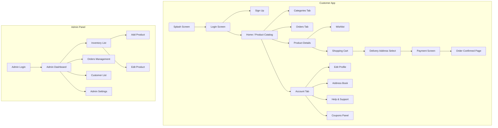

# 📱 DevArt Flutter App

Welcome to **DevArt**, a premium, high-fidelity Flutter e-commerce application featuring a dual-interface system for both **Customers** (to browse, wish, and buy products) and **Admins** (to manage inventory, customers, and orders).

This repository is designed to match and implement the Figma design layout, pages, and interactive navigation flows exactly as specified in the Figma prototype.

---

## 🎨 Figma Design & Prototype Links

- **Figma Design File (Dev Mode)**: [Figma Design Link](https://www.figma.com/design/S5bQWaqh9je6CCEzaqppYL/DevArt-Flutter-App?node-id=0-1&m=dev&t=6NYSDUl090e1h4K4-1)
- **Figma Prototype Play Link**: [Open Prototype in Figma](https://www.figma.com/proto/S5bQWaqh9je6CCEzaqppYL/DevArt-Flutter-App?node-id=0-1&scaling=scale-down&page-id=0%3A1&starting-point-node-id=0%3A1)

> [!NOTE]
> Please ensure you have access to the Figma workspace to view the layout measurements, fonts, and hex colors in Dev Mode.

---

## 🚀 Key Features & App Modules

The application is split into two major user spaces:

### 🛍️ 1. Customer Application
A tactile, minimalist mobile shopping experience for users:
* **Authentication**: Seamless Login, Sign Up, and Secure Password Management.
* **Profile & Settings**: Profile Dashboard, Edit Profile, Personal Details, and a dynamic Address Book (Add/Edit Addresses).
* **Browsing & Discovery**:
  * Home Screen featuring category filters and product grid layouts.
  * Rich Product Details page with specs and image sliders.
  * Interactive Wishlist to save favorite items.
* **Checkout Flow**:
  * Shopping Cart management (add/remove items, quantity adjust).
  * Secure multi-step Checkout (Address selection ➔ Payment gateway simulation ➔ Order success confirmation screen).
* **Orders & Offers**: Order History list and active Promo/Coupon codes integration.

### 💼 2. Admin Panel
A clean administrative tool built for shop owners to manage backend operations:
* **Admin Auth**: Dedicated Admin Login and profile state.
* **Product Management**: Dashboard statistics, live Inventory list, Add New Product interface, and Edit Product panel.
* **Order & Customer Operations**: Customer accounts list, Orders queue management, and discount/offers configuration.

---

## 🗺️ Navigation & Screen Flow

The application utilizes a bottom navigation bar for the customer experience and a clean sidebar/dashboard for the admin panel.



---

## 🛠️ Architecture & Tech Stack

The project follows a **Feature-First Clean Architecture** approach to ensure the codebase remains maintainable, scalable, and easy to test:

* **Framework**: Flutter (Dart)
* **State Management**: Choose between `Provider` (for light state) or `Flutter BLoC` (for structured state)
* **Styling & Theme**: Curated dark and light themes mapping Figma's exact token system:
  * **Earthy Brown** (`#8b5e3c`) as Primary
  * **Soft Blue** (`#a9c7eb`) as Secondary
  * **Ethereal White/Gray** (`#f8f9fa`) as Neutral/Background
* **Routing**: Declarative navigation using `go_router` or standard Named Routes for clear mapping to Figma's interactive prototype paths.

---

## 🏁 Getting Started & Setup

### Prerequisites
* Flutter SDK (v3.0.0 or higher)
* Android Studio / VS Code with Flutter extensions
* Git configured on your system

### Installation

1. **Clone the repository**:
   ```bash
   git clone https://github.com/Prem-Agravat/devart_UI.git
   cd devart_UI
   ```

2. **Get dependencies**:
   ```bash
   flutter pub get
   ```

3. **Run the application**:
   - **For Development/Debug Mode**:
     ```bash
     flutter run
     ```
   - **To build a release APK**:
     ```bash
     flutter build apk --release
     ```

---

## ✍️ Authors & License

- Designed & Configured by **Prem Agravat** ([agravatprem00@gmail.com](mailto:agravatprem00@gmail.com))
- Free to use under the MIT License.
